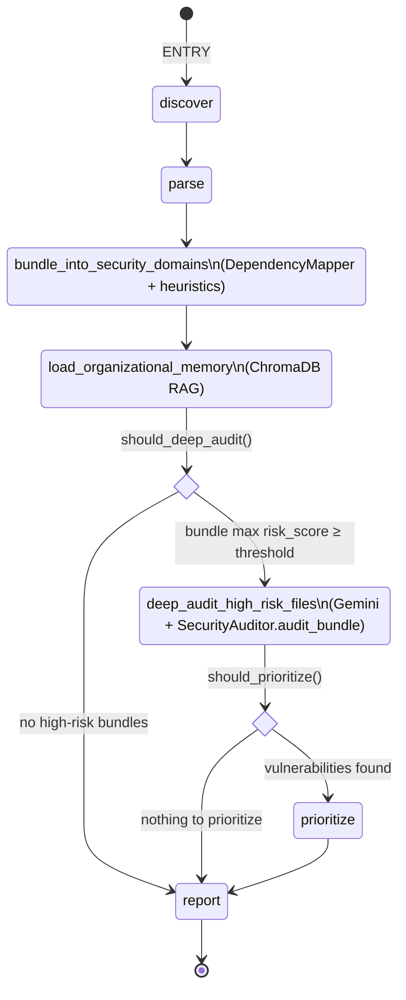
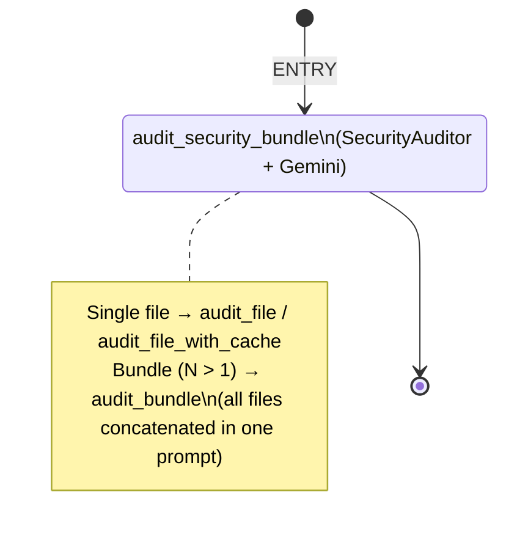
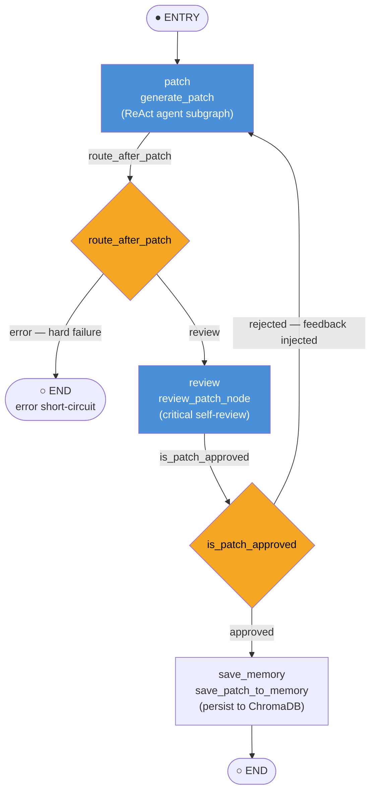

# SentryAgent — Workflow Architecture

## 1. Scan Workflow (`create_scan_workflow`)

Entry point: **discover**. After parsing, files are grouped into security-domain bundles by `bundle_into_security_domains`, then organisational memory is loaded. Two conditional edges gate expensive operations: `should_deep_audit` decides whether to invoke the Gemini auditor on high-risk bundles, and `should_prioritize` decides whether to reorder findings before reporting.

**Node responsibilities**

| Node | Function | Description |
|------|----------|-------------|
| `discover` | `discover_files` | Walk workspace, collect Python file paths |
| `parse` | `parse_and_scan` | Tree-sitter parsing, entry-point & hotspot detection, risk scoring |
| `bundle` | `bundle_into_security_domains` | Group files into overlapping security domains via heuristics + dependency graph |
| `memory` | `load_organizational_memory` | Semantic search in ChromaDB; injects past lessons into state |
| `audit` | `deep_audit_high_risk_files` | Multi-file bundle audit via Gemini; only reached when `should_deep_audit → "audit"` |
| `prioritize` | `prioritize_vulnerabilities` | Re-rank findings by severity; only reached when `should_prioritize → "prioritize"` |
| `report` | `generate_report` | Build PDF/JSON report via ReportLab |

### Security Domain Bundling

`bundle_into_security_domains` produces `ScanState.security_bundles: dict[str, list[str]]` — a mapping of domain name to file paths. Files can appear in multiple domains (intentional overlap).

**Six built-in domains and their heuristics:**

| Domain | Path keywords | Import keywords |
|--------|--------------|-----------------|
| `authentication` | auth, jwt, login, session, token, oauth, password, credential | jwt, passlib, python_jose, bcrypt, oauth2, authlib |
| `data_injection` | db, database, model, query, sql, orm, repository, dao | sqlalchemy, psycopg2, pymysql, asyncpg, databases, tortoise |
| `rate_limiting` | rate, throttle, limit, middleware | slowapi, limits, redis, aioredis, fastapi_limiter |
| `secrets_management` | config, settings, env, secret, key, credential, vault | pydantic_settings, decouple, dotenv, hvac |
| `input_validation` | schema, validator, serializer, form, request | pydantic, marshmallow, cerberus, voluptuous, wtforms |
| `access_control` | permission, role, acl, policy, authorization, rbac, admin | casbin, authz, guardian |

**Two-pass algorithm:**
1. **Heuristic pass** — match each file's relative path and its raw imports against the keyword lists above.
2. **Dependency expansion** — for each matched file, add 1-hop neighbours from the `DependencyMapper` graph (files it imports + files that import it).

A bundle triggers a deep audit if **any file in it** has a risk score ≥ `risk_threshold`.

---

## 2. Audit Workflow (`create_audit_workflow`)

Handles both single-file audits (backward-compat `/audit` endpoint) and multi-file security domain bundles. `audit_security_bundle` dispatches on `len(involved_files)`: single-file calls the existing per-file path; multi-file sends all contents in one Gemini prompt for cross-file data-flow analysis.

**`AuditState` fields:**

| Field | Type | Notes |
|-------|------|-------|
| `file_path` | `Optional[str]` | Primary file; `None` for bundle-only audits |
| `security_bundle_name` | `Optional[str]` | Domain label, e.g. `"authentication"` |
| `involved_files` | `list[str]` | All file paths in the bundle (length 1 for single-file) |
| `vulnerabilities` | `list[Vulnerability]` | Populated by audit node |
| `audit_report` | `dict` | Raw LLM output after JSON normalisation |

**Audit prompt paths:**

| Condition | Prompt template | Strategy |
|-----------|----------------|----------|
| Single file + cache | `auditor.audit_with_cache` | File path only; LLM reads from cache |
| Single file, no cache | `auditor.audit_with_context` | File content via `ContextAssembler` |
| Bundle + cache | `auditor.audit_bundle_with_cache` | File list only; LLM locates files in cache |
| Bundle, no cache | `auditor.audit_bundle_with_context` | All file contents appended after `.format()` |

> **Brace-collision safety:** bundle file contents are appended to the rendered prompt string rather than injected as a `{placeholder}` to avoid `KeyError` on `{` / `}` in Python source code.

---

## 3. Patch Workflow (`create_patch_workflow`)

Entry point: **patch** (ReAct agent subgraph). `route_after_patch` short-circuits to END on hard failures. On success the patch is reviewed; `is_patch_approved` either advances to `save_memory` or loops back to **patch** with feedback, allowing iterative self-correction.

**Conditional logic**

| Edge function | Source node | `"approved"` → | `"rejected"` / `"error"` → |
|---------------|-------------|----------------|----------------------------|
| `route_after_patch` | `patch` | `review` | `END` (hard failure) |
| `is_patch_approved` | `review` | `save_memory` | `patch` (retry loop) |

State fields that drive the loop: `retry_count`, `is_approved`, `review_feedback`. The rejected path re-enters `patch` with `review_feedback` populated so the ReAct agent can self-correct.

### Cross-file Patching (Security Domain Bundle)

`PatchState.involved_files` carries all files in the originating security bundle. `generate_patch` reads every peer file (files other than the primary `file_path`) and injects them into the ReAct agent's initial message under `=== BUNDLE FILE: <path> ===` headers.

The agent's system prompt (`app/prompts/patcher/default.md`) instructs it to:
- Read peer files to understand variable types, DB schemas, and existing sanitization before patching.
- Apply `replace_function` or `replace_class_method` on **any file in the bundle**, not just the primary target, when a fix requires cross-file changes (e.g. moving input validation from a route into a service layer).

**`PatchState` bundle fields:**

| Field | Notes |
|-------|-------|
| `file_path` | Primary file the patcher targets |
| `involved_files` | All files in the security domain bundle (includes `file_path`) |
